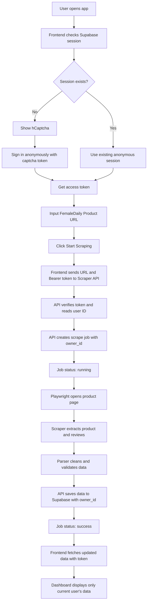
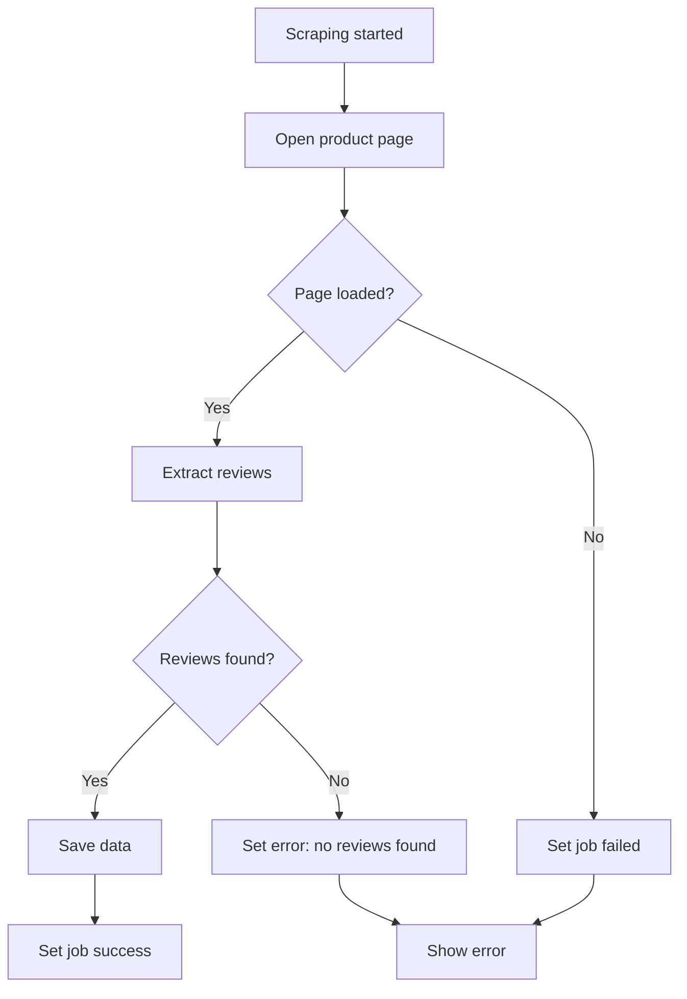
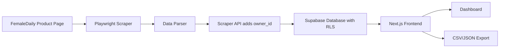

# System Architecture

## 1. Architecture Summary

The system uses a separated architecture:

- Frontend handles UI only.
- Frontend starts or restores a Supabase Anonymous Auth session for every visitor.
- hCaptcha is required before creating a new anonymous session when no session exists.
- Scraper API handles scraping logic.
- Supabase stores products, reviews, and scrape jobs.
- Supabase Row Level Security protects rows by anonymous user ID.

This separation prevents the frontend hosting from being overloaded by Playwright browser execution.
Anonymous Auth keeps the app usable without email/password while still giving every browser session a unique `auth.uid()`.

## 2. System Flow



## 3. Failure Flow



## 4. Data Flow



## 5. Auth and Data Isolation

The app uses Supabase Anonymous Auth instead of a visible login form.

- On first visit, the frontend calls anonymous sign-in.
- If no session exists, the frontend asks for hCaptcha before calling anonymous sign-in.
- Supabase creates a unique user ID and access token.
- The frontend sends the access token to the Scraper API in the `Authorization` header.
- The Scraper API verifies the token and uses the verified user ID as `owner_id`.
- Database rows are scoped by `owner_id`.
- RLS policies only allow access when `owner_id = auth.uid()`.

Anonymous session limitations:

- If the browser storage is cleared, the user may lose access to previous data.
- A different browser, incognito session, or device becomes a different anonymous user.
- Email/OAuth account upgrade is intentionally deferred for a later feature.

## 6. Deployment Architecture

```txt
Vercel
  └── Next.js frontend

Render / Railway / Fly.io
  └── Node.js Express Scraper API
      └── Playwright Chromium

Supabase
  └── PostgreSQL database
```

## 7. API Responsibilities

The scraper API is responsible for:

- Verifying Supabase access tokens
- Reading the anonymous user ID
- URL validation
- Creating scrape jobs
- Running Playwright
- Parsing review data
- Cleaning text
- Saving data to database with `owner_id`
- Updating job status
- Returning job result
- Filtering every user-facing query by `owner_id`

## 8. Frontend Responsibilities

The frontend is responsible for:

- Starting or restoring the anonymous Supabase session
- Showing hCaptcha when a new anonymous session needs captcha verification
- Sending Bearer access tokens to the Scraper API
- Form input
- UI validation
- Triggering scraping request
- Showing loading states
- Showing job status
- Displaying database records
- Exporting data
