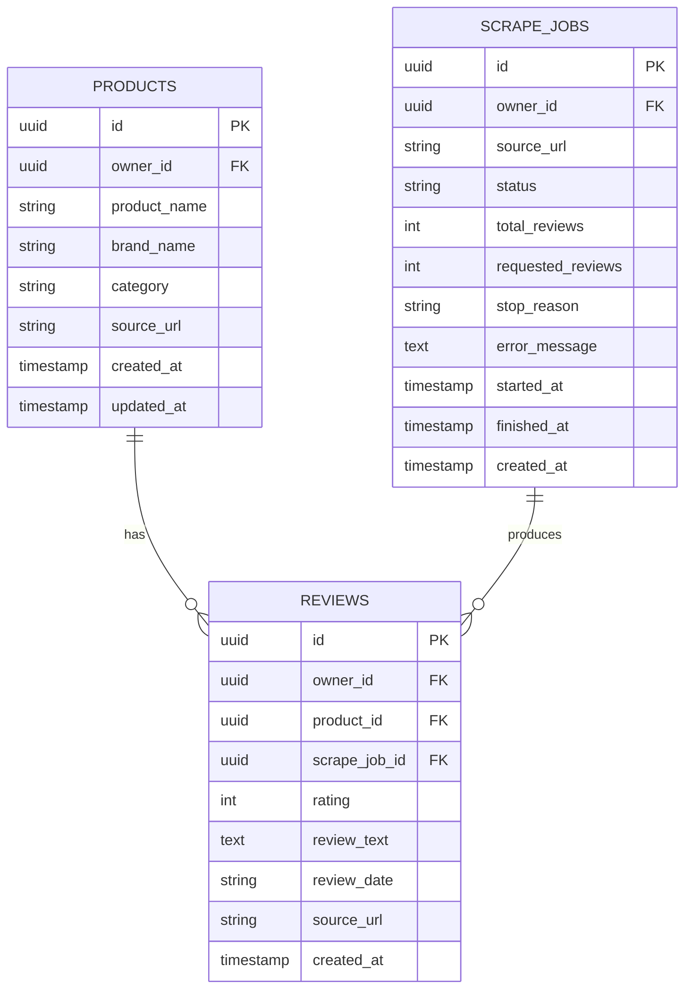

# Database Schema

## 1. ERD



## 2. Table: products

Stores scraped product information.

| Column | Type | Required | Notes |
|---|---|---:|---|
| id | uuid | yes | Primary key |
| owner_id | uuid | yes | Anonymous Supabase user ID, references auth.users.id |
| product_name | text | yes | Product name |
| brand_name | text | yes | Brand name |
| category | text | no | Product category |
| source_url | text | yes | FemaleDaily product URL |
| created_at | timestamp | yes | Auto generated |
| updated_at | timestamp | yes | Auto generated |

## 3. Table: reviews

Stores review records.

| Column | Type | Required | Notes |
|---|---|---:|---|
| id | uuid | yes | Primary key |
| owner_id | uuid | yes | Anonymous Supabase user ID, references auth.users.id |
| product_id | uuid | yes | FK to products.id |
| scrape_job_id | uuid | yes | FK to scrape_jobs.id |
| rating | integer | no | Review rating |
| review_text | text | yes | Main text for sentiment analysis |
| review_date | text | no | Date from source page |
| source_url | text | yes | Review/product source URL |
| created_at | timestamp | yes | Auto generated |

## 4. Table: scrape_jobs

Stores scraping history and process status.

| Column | Type | Required | Notes |
|---|---|---:|---|
| id | uuid | yes | Primary key |
| owner_id | uuid | yes | Anonymous Supabase user ID, references auth.users.id |
| source_url | text | yes | Requested product URL |
| status | text | yes | pending, running, success, failed |
| total_reviews | integer | no | Total scraped reviews |
| requested_reviews | integer | yes | Requested review target, 10-250 |
| stop_reason | text | no | TARGET_REACHED, NO_MORE_REVIEWS, PAGE_FAILED, MAX_LIMIT_REACHED |
| error_message | text | no | Error message if failed |
| started_at | timestamp | no | Start time |
| finished_at | timestamp | no | Finish time |
| created_at | timestamp | yes | Auto generated |

## 5. Recommended SQL

For a brand-new Supabase project, use the latest migration files in `supabase/migrations/` in order:

```txt
001_initial_schema.sql
002_scrape_job_review_target.sql
003_anonymous_auth_rls.sql
```

The consolidated SQL below describes the intended final shape after those migrations. In the current migration path, `owner_id` is added in migration `003` for compatibility with earlier rows, but all new API writes must include `owner_id`.

```sql
create table products (
  id uuid primary key default gen_random_uuid(),
  owner_id uuid not null references auth.users(id) on delete cascade,
  product_name text not null,
  brand_name text not null,
  category text,
  source_url text not null,
  created_at timestamp with time zone default now(),
  updated_at timestamp with time zone default now(),
  unique (owner_id, source_url)
);

create table scrape_jobs (
  id uuid primary key default gen_random_uuid(),
  owner_id uuid not null references auth.users(id) on delete cascade,
  source_url text not null,
  status text not null check (status in ('pending', 'running', 'success', 'failed')),
  total_reviews integer default 0,
  requested_reviews integer not null default 10 check (requested_reviews between 10 and 250),
  stop_reason text,
  error_message text,
  started_at timestamp with time zone,
  finished_at timestamp with time zone,
  created_at timestamp with time zone default now()
);

create table reviews (
  id uuid primary key default gen_random_uuid(),
  owner_id uuid not null references auth.users(id) on delete cascade,
  product_id uuid not null references products(id) on delete cascade,
  scrape_job_id uuid not null references scrape_jobs(id) on delete cascade,
  rating integer,
  review_text text not null,
  review_date text,
  source_url text not null,
  created_at timestamp with time zone default now()
);

create index idx_reviews_product_id on reviews(product_id);
create index idx_reviews_scrape_job_id on reviews(scrape_job_id);
create index idx_reviews_owner_id on reviews(owner_id);
create index idx_products_owner_id on products(owner_id);
create index idx_scrape_jobs_owner_id on scrape_jobs(owner_id);
create index idx_scrape_jobs_status on scrape_jobs(status);

alter table products enable row level security;
alter table scrape_jobs enable row level security;
alter table reviews enable row level security;

create policy "Users can read own products"
on products for select
using (owner_id = auth.uid());

create policy "Users can insert own products"
on products for insert
with check (owner_id = auth.uid());

create policy "Users can update own products"
on products for update
using (owner_id = auth.uid())
with check (owner_id = auth.uid());

create policy "Users can read own scrape jobs"
on scrape_jobs for select
using (owner_id = auth.uid());

create policy "Users can insert own scrape jobs"
on scrape_jobs for insert
with check (owner_id = auth.uid());

create policy "Users can update own scrape jobs"
on scrape_jobs for update
using (owner_id = auth.uid())
with check (owner_id = auth.uid());

create policy "Users can read own reviews"
on reviews for select
using (owner_id = auth.uid());

create policy "Users can insert own reviews"
on reviews for insert
with check (owner_id = auth.uid());
```

## 6. Ownership Rules

- Every user-facing row must include `owner_id`.
- `owner_id` is always taken from the verified Supabase access token, never from request body.
- Products are unique per user by `(owner_id, source_url)`, not globally unique by `source_url`.
- Review, job, and export queries must filter by the current user's `owner_id`.
- Public read policies are not allowed for user-owned tables.
- Service role may be used only inside the Scraper API, and API code must still filter by verified `owner_id`.
