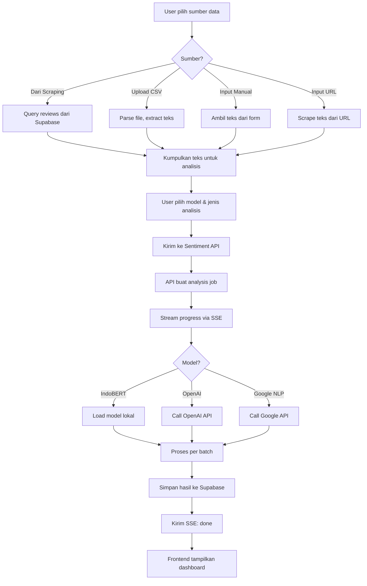
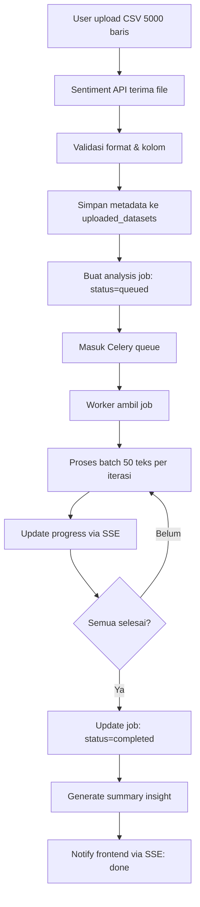

# Sentiment Analysis — System Architecture

## 1. Architecture Overview

```
┌─────────────────────────────────────────────────────────────────┐
│                        FRONTEND (Next.js)                        │
│                                                                  │
│  Landing Page ──┬── /scraper/*  (existing)                      │
│                 └── /sentiment/* (new)                           │
│                                                                  │
│  Shared: Supabase Auth, AppShell, UI Components                 │
└──────────────┬────────────────────────┬─────────────────────────┘
               │                        │
               ▼                        ▼
┌──────────────────────┐   ┌──────────────────────────────┐
│   SCRAPER API        │   │   SENTIMENT API              │
│   (Node.js Express)  │   │   (Python FastAPI)           │
│                      │   │                              │
│   - Playwright       │   │   - IndoBERT                 │
│   - HTML Parser      │   │   - OpenAI Integration       │
│   - Job Queue        │   │   - Google NLP Integration   │
│                      │   │   - Aspect Extraction        │
│   Port: 4000         │   │   - Keyword/Topic Modeling   │
│                      │   │   - SSE Streaming            │
└──────────┬───────────┘   │   - PDF Report Generator    │
           │               │                              │
           │               │   Port: 5000                 │
           │               └──────────────┬───────────────┘
           │                              │
           ▼                              ▼
┌─────────────────────────────────────────────────────────┐
│                    SUPABASE (Shared)                      │
│                                                          │
│   - PostgreSQL Database                                  │
│   - Anonymous Auth (existing)                            │
│   - Row Level Security                                   │
│   - Storage (untuk uploaded files)                       │
│                                                          │
│   Tables:                                                │
│   - products (existing)                                  │
│   - reviews (existing)                                   │
│   - scrape_jobs (existing)                               │
│   - sentiment_analyses (new)                             │
│   - sentiment_results (new)                              │
│   - analysis_configs (new)                               │
│   - uploaded_datasets (new)                              │
└─────────────────────────────────────────────────────────┘
```

## 2. Sentiment API — Tech Stack

| Layer | Technology | Purpose |
|-------|-----------|---------|
| Framework | FastAPI (Python 3.11+) | REST API + SSE streaming |
| NLP - Local | Transformers + IndoBERT | Sentiment & emotion detection |
| NLP - Aspect | Custom pipeline + spaCy | Aspect extraction |
| NLP - Keywords | KeyBERT / YAKE | Keyword extraction |
| NLP - Topics | BERTopic / LDA | Topic modeling |
| External API | OpenAI SDK, Google Cloud NLP | Third-party model support |
| Task Queue | Celery + Redis | Batch processing |
| PDF | WeasyPrint / ReportLab | PDF report generation |
| Database | Supabase (via supabase-py) | Data persistence |
| Auth | Supabase JWT verification | Token validation |
| Streaming | SSE (Server-Sent Events) | Real-time progress |

## 3. System Flow — Single Analysis



## 4. System Flow — Batch Processing



## 5. Authentication Flow

Sentiment API menggunakan auth yang sama dengan Scraper API:

1. Frontend sudah punya Supabase anonymous session (existing flow)
2. Frontend kirim `Authorization: Bearer <access_token>` ke Sentiment API
3. Sentiment API verify token via Supabase
4. Extract `user.id` sebagai `owner_id`
5. Semua data di-scope per `owner_id`

```
Frontend ──Bearer token──> Sentiment API ──verify──> Supabase Auth
                                │
                                ▼
                          owner_id = user.id
                                │
                                ▼
                    All queries filtered by owner_id
```

## 6. Real-Time Streaming (SSE)

### Endpoint: GET /analysis/{id}/stream

```
Frontend                    Sentiment API
   │                              │
   │── GET /analysis/123/stream ──>│
   │   (Authorization: Bearer)     │
   │                              │
   │<── event: progress ──────────│  {"step": "loading_data", "current": 0, "total": 150}
   │<── event: progress ──────────│  {"step": "model_ready", "model": "indobert"}
   │<── event: progress ──────────│  {"step": "analyzing", "current": 45, "total": 150}
   │<── event: preview ───────────│  {"positive": 23, "negative": 15, "neutral": 7}
   │<── event: progress ──────────│  {"step": "analyzing", "current": 100, "total": 150}
   │<── event: progress ──────────│  {"step": "analyzing", "current": 150, "total": 150}
   │<── event: progress ──────────│  {"step": "saving", "message": "Menyimpan hasil..."}
   │<── event: done ──────────────│  {"analysis_id": "123", "redirect": "/sentiment/results/123"}
   │                              │
```

## 7. API Key Management

User API keys (OpenAI, Google) disimpan di Supabase:

- Encrypted at rest (menggunakan Supabase Vault atau pgcrypto)
- Per user (owner_id)
- Frontend hanya kirim key saat setup, tidak pernah display full key
- Sentiment API decrypt key saat dibutuhkan untuk API call
- Key bisa di-revoke/update kapan saja

## 8. Deployment Architecture

```
Vercel
  └── Next.js Frontend (existing + sentiment pages)

Render / Railway / Fly.io (existing)
  └── Node.js Express Scraper API

Render / Railway / Fly.io (new)
  └── Python FastAPI Sentiment API
      ├── Celery Worker (batch processing)
      └── Redis (task queue)

Supabase (shared, existing)
  └── PostgreSQL + Auth + Storage
```

## 9. Environment Variables — Sentiment API

```env
# Supabase
SUPABASE_URL=https://xxx.supabase.co
SUPABASE_SERVICE_ROLE_KEY=eyJ...

# Redis (untuk Celery)
REDIS_URL=redis://localhost:6379/0

# Model paths
INDOBERT_MODEL_PATH=./models/indobert
INDOBERT_SENTIMENT_MODEL=mdhugol/indonesia-bert-sentiment-classification

# Server
PORT=5000
HOST=0.0.0.0
CORS_ORIGINS=http://localhost:3000,https://your-frontend.vercel.app

# Optional: default model jika user tidak pilih
DEFAULT_MODEL=indobert
```

## 10. Frontend Environment (tambahan)

```env
# Existing
NEXT_PUBLIC_SUPABASE_URL=...
NEXT_PUBLIC_SUPABASE_ANON_KEY=...
NEXT_PUBLIC_SCRAPER_API_URL=http://localhost:4000

# New
NEXT_PUBLIC_SENTIMENT_API_URL=http://localhost:5000
```

## 11. Error Handling

| Error | Response | User Message |
|-------|----------|-------------|
| Token invalid | 401 | "Sesi habis, silakan refresh halaman" |
| Model load failed | 500 | "Model gagal dimuat, coba lagi" |
| API key invalid | 400 | "API key tidak valid, periksa di Settings" |
| Rate limit (OpenAI) | 429 | "Rate limit tercapai, tunggu sebentar" |
| File too large | 413 | "File terlalu besar, maksimum 5000 baris" |
| Invalid file format | 400 | "Format file tidak didukung" |
| Analysis timeout | 504 | "Analisis timeout, coba dengan data lebih sedikit" |
| Redis down | 503 | "Service sedang maintenance" |
