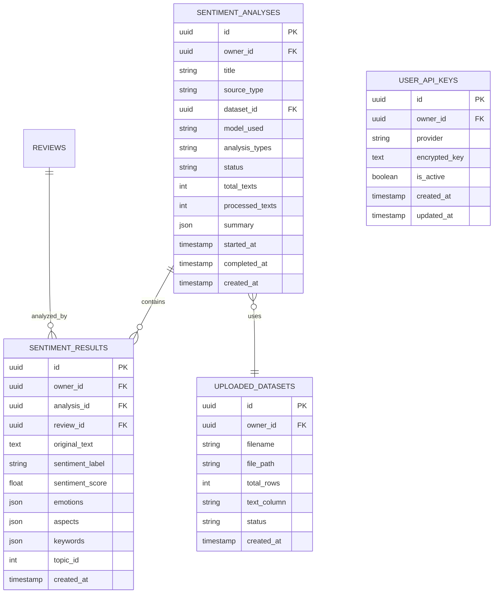

# Sentiment Analysis — Database Schema

## 1. ERD (New Tables)



## 2. Table: sentiment_analyses

Stores metadata for each analysis session.

| Column | Type | Required | Notes |
|--------|------|:--------:|-------|
| id | uuid | yes | Primary key |
| owner_id | uuid | yes | FK to auth.users.id |
| title | text | yes | User-defined or auto-generated title |
| source_type | text | yes | `scraping`, `upload`, `manual`, `url` |
| dataset_id | uuid | no | FK to uploaded_datasets.id (if source=upload) |
| source_filter | jsonb | no | Filter criteria jika source=scraping (product_id, date_range, etc) |
| model_used | text | yes | `indobert`, `openai-gpt4o-mini`, `openai-gpt4o`, `google-nlp`, `textblob` |
| analysis_types | text[] | yes | Array: `sentiment`, `emotion`, `aspect`, `keyword`, `topic` |
| status | text | yes | `queued`, `loading`, `processing`, `completed`, `failed`, `cancelled` |
| total_texts | integer | yes | Total teks yang akan dianalisis |
| processed_texts | integer | yes | Teks yang sudah diproses (untuk progress) |
| summary | jsonb | no | Auto-generated summary setelah selesai |
| error_message | text | no | Error message jika failed |
| started_at | timestamptz | no | Waktu mulai proses |
| completed_at | timestamptz | no | Waktu selesai |
| created_at | timestamptz | yes | Auto generated |

### Status values:
- `queued` — Menunggu di antrian (batch)
- `loading` — Memuat data/model
- `processing` — Sedang menganalisis
- `completed` — Selesai
- `failed` — Gagal
- `cancelled` — Dibatalkan user

## 3. Table: sentiment_results

Stores per-text analysis results.

| Column | Type | Required | Notes |
|--------|------|:--------:|-------|
| id | uuid | yes | Primary key |
| owner_id | uuid | yes | FK to auth.users.id |
| analysis_id | uuid | yes | FK to sentiment_analyses.id |
| review_id | uuid | no | FK to reviews.id (jika source=scraping) |
| original_text | text | yes | Teks asli yang dianalisis |
| sentiment_label | text | yes | `positive`, `negative`, `neutral` |
| sentiment_score | float | yes | 0.0 - 1.0 confidence |
| emotions | jsonb | no | `{"joy": 0.8, "anger": 0.1, "sadness": 0.05, ...}` |
| dominant_emotion | text | no | Emosi dengan skor tertinggi |
| aspects | jsonb | no | `[{"aspect": "harga", "sentiment": "negative", "score": 0.85}, ...]` |
| keywords | text[] | no | Array of extracted keywords |
| topic_id | integer | no | Topic cluster ID (dari topic modeling) |
| topic_label | text | no | Auto-generated topic label |
| created_at | timestamptz | yes | Auto generated |

### Contoh emotions JSON:
```json
{
  "joy": 0.82,
  "anger": 0.05,
  "sadness": 0.03,
  "fear": 0.02,
  "surprise": 0.06,
  "disgust": 0.02
}
```

### Contoh aspects JSON:
```json
[
  {"aspect": "kualitas", "sentiment": "positive", "score": 0.92},
  {"aspect": "harga", "sentiment": "negative", "score": 0.85},
  {"aspect": "pengiriman", "sentiment": "negative", "score": 0.78}
]
```

## 4. Table: uploaded_datasets

Stores metadata for user-uploaded files.

| Column | Type | Required | Notes |
|--------|------|:--------:|-------|
| id | uuid | yes | Primary key |
| owner_id | uuid | yes | FK to auth.users.id |
| filename | text | yes | Original filename |
| file_path | text | yes | Supabase Storage path |
| file_size | integer | yes | File size in bytes |
| total_rows | integer | yes | Total rows in file |
| text_column | text | yes | Column name yang berisi teks |
| columns | text[] | yes | All column names in file |
| status | text | yes | `uploaded`, `validated`, `error` |
| error_message | text | no | Validation error |
| created_at | timestamptz | yes | Auto generated |

## 5. Table: user_api_keys

Stores encrypted API keys per user.

| Column | Type | Required | Notes |
|--------|------|:--------:|-------|
| id | uuid | yes | Primary key |
| owner_id | uuid | yes | FK to auth.users.id |
| provider | text | yes | `openai`, `google` |
| encrypted_key | text | yes | Encrypted with pgcrypto |
| key_hint | text | yes | Last 4 chars for display (e.g., "...a3Bf") |
| is_active | boolean | yes | Default true |
| created_at | timestamptz | yes | Auto generated |
| updated_at | timestamptz | yes | Auto generated |

## 6. SQL Migration

```sql
-- Migration: 004_sentiment_analysis_tables.sql

-- Uploaded datasets
create table uploaded_datasets (
  id uuid primary key default gen_random_uuid(),
  owner_id uuid not null references auth.users(id) on delete cascade,
  filename text not null,
  file_path text not null,
  file_size integer not null default 0,
  total_rows integer not null default 0,
  text_column text not null,
  columns text[] not null default '{}',
  status text not null default 'uploaded' check (status in ('uploaded', 'validated', 'error')),
  error_message text,
  created_at timestamptz default now()
);

-- Sentiment analyses (job/session)
create table sentiment_analyses (
  id uuid primary key default gen_random_uuid(),
  owner_id uuid not null references auth.users(id) on delete cascade,
  title text not null,
  source_type text not null check (source_type in ('scraping', 'upload', 'manual', 'url')),
  dataset_id uuid references uploaded_datasets(id) on delete set null,
  source_filter jsonb,
  model_used text not null,
  analysis_types text[] not null default '{sentiment}',
  status text not null default 'queued' check (status in ('queued', 'loading', 'processing', 'completed', 'failed', 'cancelled')),
  total_texts integer not null default 0,
  processed_texts integer not null default 0,
  summary jsonb,
  error_message text,
  started_at timestamptz,
  completed_at timestamptz,
  created_at timestamptz default now()
);

-- Sentiment results (per text)
create table sentiment_results (
  id uuid primary key default gen_random_uuid(),
  owner_id uuid not null references auth.users(id) on delete cascade,
  analysis_id uuid not null references sentiment_analyses(id) on delete cascade,
  review_id uuid references reviews(id) on delete set null,
  original_text text not null,
  sentiment_label text not null check (sentiment_label in ('positive', 'negative', 'neutral')),
  sentiment_score float not null default 0.0,
  emotions jsonb,
  dominant_emotion text,
  aspects jsonb,
  keywords text[],
  topic_id integer,
  topic_label text,
  created_at timestamptz default now()
);

-- User API keys
create table user_api_keys (
  id uuid primary key default gen_random_uuid(),
  owner_id uuid not null references auth.users(id) on delete cascade,
  provider text not null check (provider in ('openai', 'google')),
  encrypted_key text not null,
  key_hint text not null default '',
  is_active boolean not null default true,
  created_at timestamptz default now(),
  updated_at timestamptz default now(),
  unique (owner_id, provider)
);

-- Indexes
create index idx_sentiment_analyses_owner on sentiment_analyses(owner_id);
create index idx_sentiment_analyses_status on sentiment_analyses(status);
create index idx_sentiment_results_analysis on sentiment_results(analysis_id);
create index idx_sentiment_results_owner on sentiment_results(owner_id);
create index idx_sentiment_results_sentiment on sentiment_results(sentiment_label);
create index idx_uploaded_datasets_owner on uploaded_datasets(owner_id);
create index idx_user_api_keys_owner on user_api_keys(owner_id);

-- RLS
alter table uploaded_datasets enable row level security;
alter table sentiment_analyses enable row level security;
alter table sentiment_results enable row level security;
alter table user_api_keys enable row level security;

-- Policies: uploaded_datasets
create policy "Users can read own datasets"
on uploaded_datasets for select using (owner_id = auth.uid());

create policy "Users can insert own datasets"
on uploaded_datasets for insert with check (owner_id = auth.uid());

create policy "Users can delete own datasets"
on uploaded_datasets for delete using (owner_id = auth.uid());

-- Policies: sentiment_analyses
create policy "Users can read own analyses"
on sentiment_analyses for select using (owner_id = auth.uid());

create policy "Users can insert own analyses"
on sentiment_analyses for insert with check (owner_id = auth.uid());

create policy "Users can update own analyses"
on sentiment_analyses for update using (owner_id = auth.uid()) with check (owner_id = auth.uid());

create policy "Users can delete own analyses"
on sentiment_analyses for delete using (owner_id = auth.uid());

-- Policies: sentiment_results
create policy "Users can read own results"
on sentiment_results for select using (owner_id = auth.uid());

create policy "Users can insert own results"
on sentiment_results for insert with check (owner_id = auth.uid());

create policy "Users can delete own results"
on sentiment_results for delete using (owner_id = auth.uid());

-- Policies: user_api_keys
create policy "Users can read own keys"
on user_api_keys for select using (owner_id = auth.uid());

create policy "Users can insert own keys"
on user_api_keys for insert with check (owner_id = auth.uid());

create policy "Users can update own keys"
on user_api_keys for update using (owner_id = auth.uid()) with check (owner_id = auth.uid());

create policy "Users can delete own keys"
on user_api_keys for delete using (owner_id = auth.uid());
```

## 7. Summary JSON Structure

Disimpan di `sentiment_analyses.summary` setelah analisis selesai:

```json
{
  "sentiment_distribution": {
    "positive": 105,
    "negative": 30,
    "neutral": 15
  },
  "sentiment_percentage": {
    "positive": 70.0,
    "negative": 20.0,
    "neutral": 10.0
  },
  "dominant_sentiment": "positive",
  "emotion_distribution": {
    "joy": 85,
    "anger": 20,
    "sadness": 15,
    "fear": 10,
    "surprise": 12,
    "disgust": 8
  },
  "dominant_emotion": "joy",
  "top_aspects": [
    {"aspect": "kualitas", "positive": 80, "negative": 10},
    {"aspect": "harga", "positive": 30, "negative": 45},
    {"aspect": "pengiriman", "positive": 20, "negative": 35}
  ],
  "top_keywords": ["bagus", "murah", "lama", "recommended", "kecewa"],
  "topics": [
    {"id": 0, "label": "Kualitas Produk", "count": 60},
    {"id": 1, "label": "Harga & Value", "count": 45},
    {"id": 2, "label": "Pengiriman", "count": 35}
  ],
  "auto_insight": "70% review positif. Aspek kualitas mendominasi sentimen positif (89%). Keluhan utama terkait pengiriman (63% negatif) dan harga (60% negatif). Emosi dominan: Joy (57%).",
  "processing_time_seconds": 45.2,
  "model_used": "indobert"
}
```
