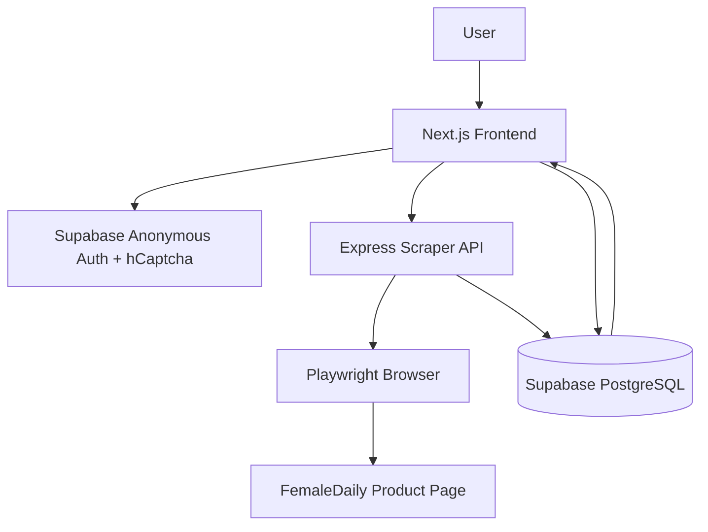
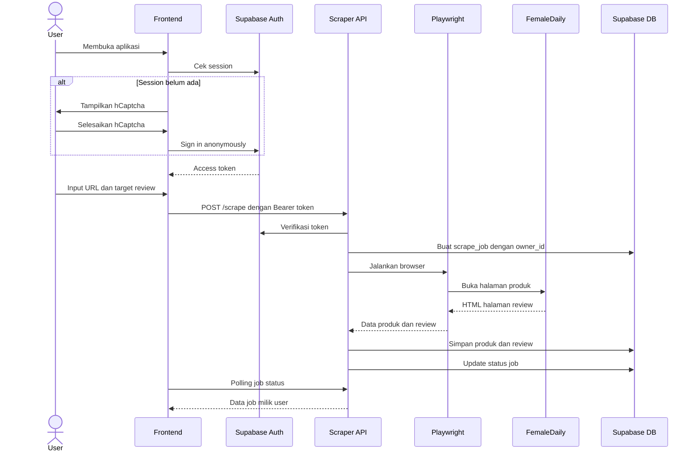
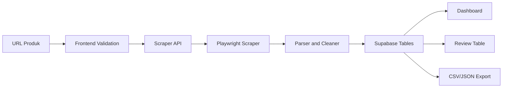

# System Architecture

## Ringkasan Arsitektur

Metrif Scraper menggunakan arsitektur terpisah antara frontend, backend scraper, dan database. Pemisahan ini penting karena proses scraping menggunakan Playwright membutuhkan resource lebih besar dan tidak cocok dijalankan langsung dari rendering frontend.

Komponen utama:

- Next.js frontend untuk UI.
- Express.js scraper API untuk proses backend.
- Playwright untuk membuka dan membaca halaman review.
- Supabase PostgreSQL untuk penyimpanan data.
- Supabase Anonymous Auth untuk identitas user.
- hCaptcha sebagai proteksi sebelum membuat anonymous session baru.

## Diagram Arsitektur Tingkat Tinggi

## Alur Utama Sistem

## Komponen Frontend

Frontend bertugas:

- Menampilkan halaman landing dan dashboard.
- Mengelola anonymous session di browser.
- Menampilkan hCaptcha jika session belum ada.
- Mengirim request API dengan Bearer token.
- Menampilkan loading, empty, success, dan error state.
- Menyediakan export dataset dari data review.

## Komponen Scraper API

Scraper API bertugas:

- Memverifikasi Supabase access token.
- Menentukan `owner_id` dari token.
- Memvalidasi URL FemaleDaily.
- Membuat scrape job.
- Menjalankan Playwright.
- Membersihkan data hasil scraping.
- Menyimpan data ke Supabase.
- Mengembalikan data job, produk, review, dan export.

## Komponen Database

Database menyimpan:

- `products` untuk data produk.
- `reviews` untuk data review.
- `scrape_jobs` untuk riwayat proses scraping.

Setiap row user-facing memiliki `owner_id`. Field ini dipakai untuk membatasi akses data agar user hanya melihat data miliknya sendiri.

## Data Flow

## Prinsip Desain

Prinsip arsitektur:

- Frontend tidak menjalankan Playwright.
- Backend bertanggung jawab untuk scraping dan database write.
- Semua request user-facing memakai Bearer token.
- `owner_id` tidak pernah diterima dari client.
- RLS digunakan untuk isolasi data.
- Scraping dibatasi untuk data publik yang relevan.

