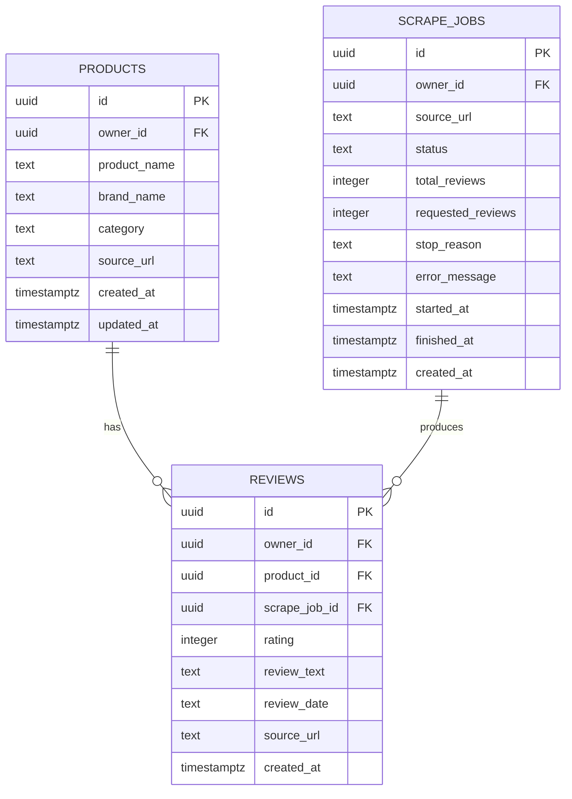

# Database Design

## Database

Project memakai Supabase PostgreSQL. Database dirancang untuk menyimpan hasil scraping per pengguna anonim. Setiap data user-facing diberi `owner_id` yang berasal dari Supabase Auth user ID.

## Tabel Utama

Tabel yang digunakan:

- `products`
- `reviews`
- `scrape_jobs`

## ERD



## Tabel `products`

Menyimpan informasi produk yang berhasil dibaca dari halaman FemaleDaily.

| Column | Type | Keterangan |
|---|---|---|
| `id` | uuid | Primary key |
| `owner_id` | uuid | Pemilik data berdasarkan Supabase user ID |
| `product_name` | text | Nama produk |
| `brand_name` | text | Nama brand |
| `category` | text | Kategori produk jika tersedia |
| `source_url` | text | URL produk sumber |
| `created_at` | timestamptz | Waktu data dibuat |
| `updated_at` | timestamptz | Waktu update terakhir |

Constraint penting:

- Unique per user: `(owner_id, source_url)`.

## Tabel `reviews`

Menyimpan review yang dikumpulkan.

| Column | Type | Keterangan |
|---|---|---|
| `id` | uuid | Primary key |
| `owner_id` | uuid | Pemilik data |
| `product_id` | uuid | Relasi ke `products.id` |
| `scrape_job_id` | uuid | Relasi ke `scrape_jobs.id` |
| `rating` | integer | Rating 1 sampai 5 jika tersedia |
| `review_text` | text | Teks review utama |
| `review_date` | text | Tanggal review dari sumber |
| `source_url` | text | URL sumber |
| `created_at` | timestamptz | Waktu data dibuat |

Aturan:

- Review wajib punya `product_id`.
- Review wajib punya `scrape_job_id`.
- Review wajib punya `owner_id`.
- Duplicate review dicegah di service layer dengan kombinasi teks, tanggal, dan rating.

## Tabel `scrape_jobs`

Menyimpan riwayat proses scraping.

| Column | Type | Keterangan |
|---|---|---|
| `id` | uuid | Primary key |
| `owner_id` | uuid | Pemilik job |
| `source_url` | text | URL yang diminta user |
| `status` | text | `pending`, `running`, `success`, `failed` |
| `total_reviews` | integer | Jumlah review yang berhasil dikumpulkan |
| `requested_reviews` | integer | Target review 10 sampai 250 |
| `stop_reason` | text | Alasan scraper berhenti |
| `error_message` | text | Error jika gagal |
| `started_at` | timestamptz | Waktu mulai |
| `finished_at` | timestamptz | Waktu selesai |
| `created_at` | timestamptz | Waktu job dibuat |

Stop reason:

- `TARGET_REACHED`
- `NO_MORE_REVIEWS`
- `PAGE_FAILED`
- `MAX_LIMIT_REACHED`

## Row Level Security

RLS aktif untuk:

- `products`
- `reviews`
- `scrape_jobs`

Kebijakan utama:

```sql
using (owner_id = auth.uid())
with check (owner_id = auth.uid())
```

Catatan:

- API memakai service role key untuk insert/update.
- Walaupun service role melewati RLS, API tetap wajib filter dengan `owner_id`.
- Client tidak boleh mengirim atau menentukan `owner_id`.

## Migration

Migration yang digunakan:

```txt
001_initial_schema.sql
002_scrape_job_review_target.sql
003_anonymous_auth_rls.sql
```

Urutan migration penting agar schema akhir sesuai dengan aplikasi.

