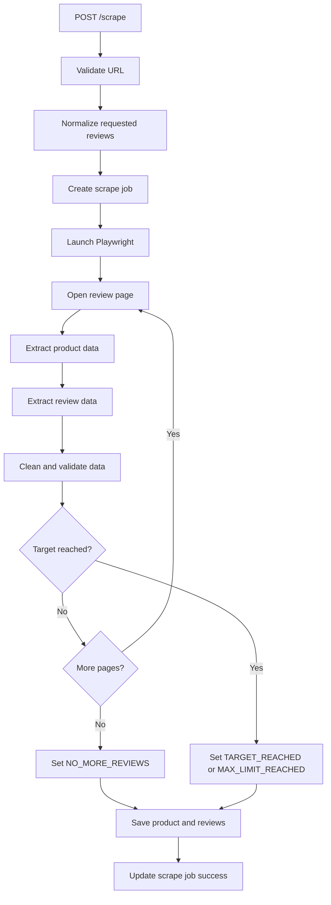

# Scraper Design

## Tujuan Scraper

Scraper bertugas mengambil data review publik dari halaman produk FemaleDaily. Scraper hanya mengambil data yang relevan untuk dataset review dan tidak mengambil data pribadi yang tidak diperlukan.

## Stack Scraper

Backend scraper menggunakan:

- Node.js.
- Express.js.
- TypeScript.
- Playwright.
- Supabase client.

## Data yang Diambil

Data yang diperbolehkan:

```txt
product_name
brand_name
category
rating
review_date
review_text
source_url
scraped_at
```

Data yang tidak boleh diambil:

```txt
user profile pages
user photos
private endpoints
backend endpoints
data pribadi yang tidak relevan
```

## Proses Scraping



## Target Review

Target review berasal dari request `maxReviews`.

Aturan:

- Minimum 10.
- Default 10.
- Maksimum 250.
- Dibulatkan ke atas dalam kelipatan 10.

Backend tetap melakukan normalisasi walaupun frontend sudah membatasi input.

## Stop Reason

`stop_reason` menjelaskan kenapa scraper berhenti:

| Stop reason | Arti |
|---|---|
| `TARGET_REACHED` | Target review terpenuhi |
| `NO_MORE_REVIEWS` | Review di halaman sumber sudah habis |
| `PAGE_FAILED` | Halaman berikutnya gagal dibaca |
| `MAX_LIMIT_REACHED` | Batas maksimum 250 tercapai |

## Cleaning Data

Review text dibersihkan dengan aturan:

- Trim whitespace.
- Hilangkan multiple spaces.
- Hilangkan style/code text yang ikut terbaca.
- Hilangkan metadata yang tidak relevan.
- Tidak mengubah makna review.
- Tidak menerjemahkan isi review.

## Duplicate Handling

Duplicate review dicegah dengan kombinasi:

- `review_text`
- `review_date`
- `rating`

Pengecekan dilakukan per produk dan per owner.

## Error Handling

Jika scraping gagal:

- Job diupdate menjadi `failed`.
- `stop_reason` dapat diisi `PAGE_FAILED`.
- `error_message` berisi kode error.
- Browser ditutup dengan aman.
- Error dicatat di log backend.

## Safety Rules

Scraper tidak boleh:

- Bypass captcha.
- Bypass login.
- Mengakses private endpoint.
- Mengambil user profile.
- Mengambil user photo.
- Menjalankan crawling agresif.

Scraper harus:

- Menggunakan scope kecil.
- Menutup browser setelah selesai.
- Memakai timeout.
- Memiliki delay antar halaman.
- Menghormati batas target review.

