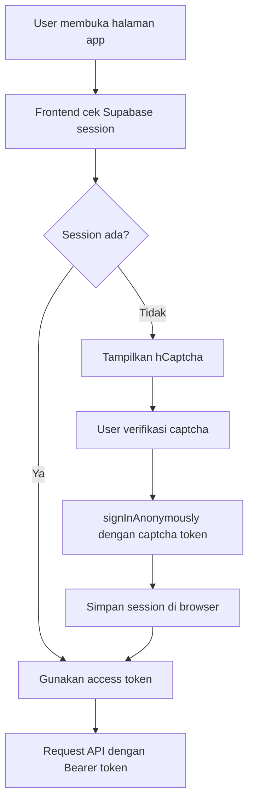

# Auth and Security

## Ringkasan

Metrif Scraper memakai Supabase Anonymous Auth agar user dapat memakai aplikasi tanpa form email/password. Setiap browser session mendapatkan user ID unik dari Supabase. User ID ini dipakai sebagai `owner_id` untuk membatasi akses data.

hCaptcha digunakan sebagai gate sebelum membuat anonymous session baru. Tujuannya mengurangi penyalahgunaan endpoint anonymous sign-in.

## Anonymous Auth Flow



## Bearer Token

Frontend mengirim token ke API:

```txt
Authorization: Bearer <supabase_access_token>
```

API memverifikasi token melalui Supabase:

- Jika valid, API mengambil `user.id`.
- Jika tidak valid, API mengembalikan `401`.
- Jika token expired, frontend mencoba refresh session dan retry sekali.

## Owner ID

`owner_id` adalah field penting untuk isolasi data.

Aturan:

- `owner_id` selalu berasal dari token terverifikasi.
- Client tidak boleh mengirim `owner_id`.
- API tidak boleh percaya `owner_id` dari body/query.
- Semua query data harus scoped by `owner_id`.

## Row Level Security

Supabase RLS aktif di:

- `products`
- `reviews`
- `scrape_jobs`

Policy umum:

```sql
owner_id = auth.uid()
```

Dengan policy ini, user hanya bisa membaca data miliknya sendiri ketika akses dilakukan melalui anon/authenticated client.

## Service Role Key

Scraper API memakai `SUPABASE_SERVICE_ROLE_KEY` untuk kebutuhan insert/update dari backend.

Aturan keamanan:

- Service role key hanya ada di backend.
- Service role key tidak boleh masuk ke frontend.
- Service role key tidak boleh dicommit.
- Walaupun service role melewati RLS, API tetap wajib filter `owner_id`.

## Environment Security

Frontend hanya boleh menyimpan:

```txt
NEXT_PUBLIC_SUPABASE_URL
NEXT_PUBLIC_SUPABASE_ANON_KEY
NEXT_PUBLIC_SCRAPER_API_URL
NEXT_PUBLIC_HCAPTCHA_SITE_KEY
```

Backend menyimpan:

```txt
SUPABASE_URL
SUPABASE_ANON_KEY
SUPABASE_SERVICE_ROLE_KEY
ADMIN_SECRET_KEY
NODE_ENV
PORT
```

## Threats and Mitigation

| Risiko | Mitigasi |
|---|---|
| User melihat data user lain | RLS dan query by `owner_id` |
| Token expired | Refresh session dan retry sekali |
| Anonymous sign-in disalahgunakan | hCaptcha gate |
| Service key bocor | Simpan hanya di backend env |
| Scraper dipakai untuk URL tidak valid | URL validation |
| Scraper melakukan aggressive crawling | Target maksimal 250 dan delay |

## Catatan Privasi

Metrif Scraper hanya mengambil data review publik yang relevan untuk analisis. Sistem tidak dirancang untuk mengambil profil user, foto user, atau data pribadi yang tidak dibutuhkan.

