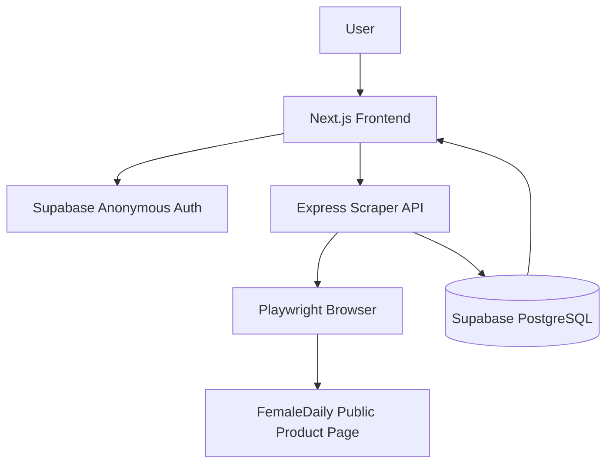
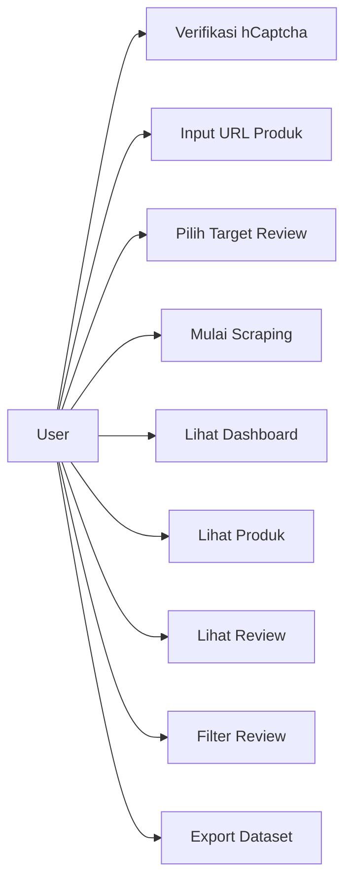
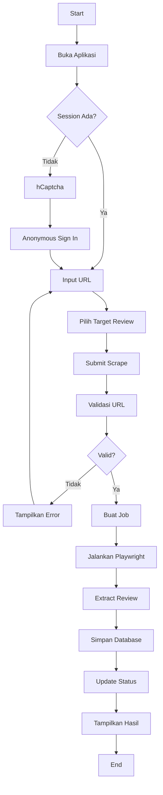
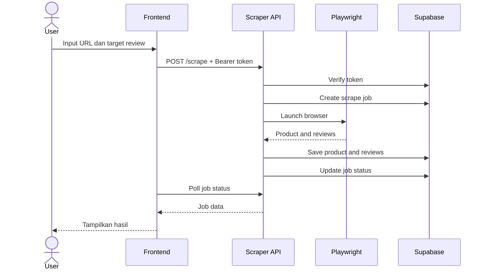
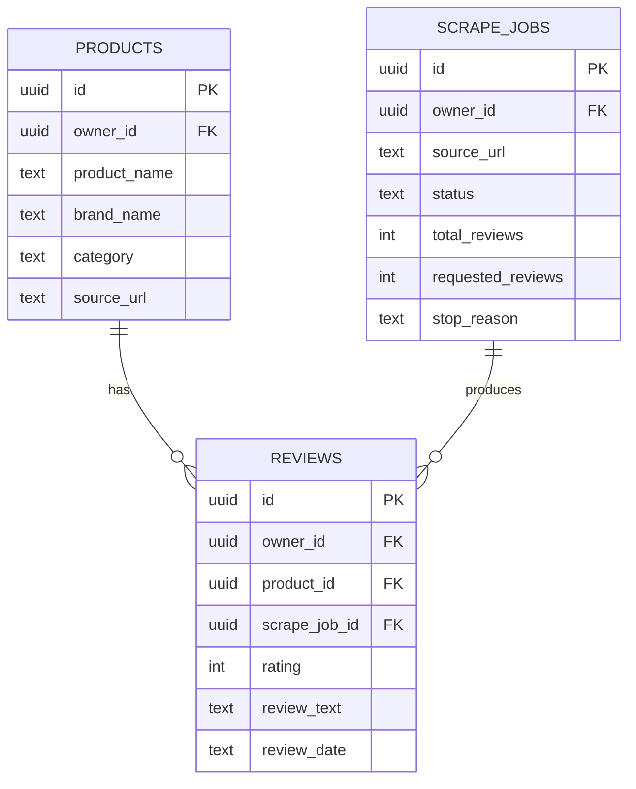

# Laporan Akhir Tugas - Metrif Scraper

## Judul

Perancangan dan Implementasi Aplikasi Metrif Scraper untuk Pengumpulan Dataset Review Produk FemaleDaily Berbasis Web

## Abstrak

Metrif Scraper adalah aplikasi web yang dirancang untuk membantu proses pengumpulan data review produk dari halaman publik FemaleDaily. Aplikasi ini menyediakan antarmuka dashboard untuk input URL produk, menjalankan proses scraping melalui backend terpisah, menyimpan data ke Supabase PostgreSQL, menampilkan hasil dalam tabel, serta mengekspor dataset ke format CSV dan JSON.

Sistem dibangun menggunakan Next.js pada sisi frontend, Express.js dan Playwright pada sisi backend, serta Supabase untuk autentikasi anonim dan penyimpanan database. Aplikasi juga menerapkan hCaptcha sebelum pembuatan anonymous session dan Row Level Security untuk membatasi akses data berdasarkan `owner_id`.

Hasil akhir project adalah MVP yang dapat digunakan untuk mengumpulkan data review publik secara lebih terstruktur dan dapat menjadi dasar untuk pengembangan sentiment analysis pada tahap berikutnya.

## 1. Latar Belakang

Review produk merupakan salah satu sumber data penting untuk memahami opini pengguna. Dalam konteks produk kecantikan, review dapat digunakan untuk menganalisis persepsi konsumen terhadap kualitas, kecocokan, harga, dan pengalaman pemakaian.

Pengumpulan review secara manual membutuhkan waktu dan rawan kesalahan. Oleh karena itu, dibutuhkan aplikasi yang dapat membantu mengambil data review secara terstruktur, menyimpannya dalam database, dan menyediakan export dataset untuk kebutuhan analisis lanjutan.

## 2. Rumusan Masalah

Rumusan masalah project:

1. Bagaimana merancang aplikasi web untuk mengumpulkan data review produk FemaleDaily?
2. Bagaimana memisahkan proses scraping dari frontend agar aplikasi tetap stabil?
3. Bagaimana menyimpan data produk, review, dan job scraping secara terstruktur?
4. Bagaimana membatasi data agar setiap pengguna hanya melihat data miliknya?
5. Bagaimana menyediakan export dataset ke CSV dan JSON?

## 3. Tujuan

Tujuan project:

1. Membuat dashboard web untuk input URL produk dan target review.
2. Membuat scraper backend menggunakan Playwright.
3. Menyimpan hasil scraping ke Supabase PostgreSQL.
4. Menampilkan produk, review, dan status scraping.
5. Menyediakan fitur pencarian, filter, dan export dataset.
6. Menerapkan anonymous auth, hCaptcha, dan data isolation.

## 4. Batasan Masalah

Batasan project:

- Data yang diambil hanya review publik.
- Aplikasi tidak melakukan sentiment analysis.
- Aplikasi tidak mengambil profil user atau foto user.
- Aplikasi tidak melakukan bypass login, captcha, atau rate limit.
- Target scraping dibatasi 10 sampai 250 review per job.
- Aplikasi menggunakan anonymous session, belum memakai login email/password.

## 5. Metodologi Pengembangan

Metode pengembangan dilakukan secara bertahap:

1. Analisis kebutuhan.
2. Perancangan arsitektur sistem.
3. Perancangan database.
4. Implementasi frontend.
5. Implementasi scraper API.
6. Integrasi Supabase Auth dan database.
7. Pengujian fitur.
8. Dokumentasi dan laporan akhir.

## 6. Kebutuhan Sistem

### 6.1 Kebutuhan Fungsional

Sistem harus dapat:

- Membuat anonymous session.
- Memvalidasi URL produk.
- Membuat scrape job.
- Mengambil review publik.
- Menyimpan produk dan review.
- Menampilkan dashboard.
- Menampilkan daftar produk.
- Menampilkan daftar review.
- Melakukan search dan filter.
- Mengekspor CSV dan JSON.

### 6.2 Kebutuhan Non-Fungsional

Sistem harus:

- Responsif pada desktop dan mobile.
- Memiliki UI yang mudah dipahami.
- Memiliki error handling.
- Menjaga pemisahan data per user.
- Tidak menyimpan secret di frontend.
- Tidak menjalankan scraping di frontend.

## 7. Arsitektur Sistem

Penjelasan:

- User berinteraksi dengan frontend.
- Frontend membuat anonymous session melalui Supabase.
- Frontend mengirim request scraping ke API.
- API memverifikasi token dan menjalankan Playwright.
- Hasil scraping disimpan ke database.
- Frontend membaca data untuk ditampilkan ke user.

## 8. Use Case Diagram

## 9. Activity Diagram

## 10. Sequence Diagram

## 11. ERD

## 12. Implementasi Teknologi

Frontend:

- Next.js
- TypeScript
- Tailwind CSS
- Supabase JS
- hCaptcha React
- Lucide React

Backend:

- Node.js
- Express.js
- TypeScript
- Playwright
- Supabase client

Database:

- Supabase PostgreSQL
- Row Level Security

## 13. Hasil Implementasi

Hasil yang sudah tersedia:

- Landing page Metrif Scraper.
- Dashboard ringkasan.
- Form scraping.
- Job status dan polling.
- Product list.
- Review table.
- Search dan filter.
- Export CSV/JSON.
- Anonymous Auth dengan hCaptcha.
- Database schema dan RLS.

## 14. Pengujian

Pengujian yang disarankan:

- Uji validasi URL.
- Uji anonymous auth.
- Uji pembuatan scrape job.
- Uji scraping target 10 review.
- Uji penyimpanan database.
- Uji filter review.
- Uji export CSV/JSON.
- Uji responsive layout.
- Uji data isolation antar user.

## 15. Kesimpulan

Metrif Scraper berhasil dirancang sebagai aplikasi pengumpulan dataset review berbasis web. Sistem sudah memisahkan UI dan proses scraping, menyimpan data secara terstruktur, dan menyediakan export dataset. Dengan arsitektur ini, project dapat dikembangkan lebih lanjut menjadi sistem analisis sentimen atau dashboard riset yang lebih lengkap.

## 16. Saran Pengembangan

Saran pengembangan:

- Menambahkan account upgrade email/OAuth.
- Menambahkan sentiment analysis.
- Menambahkan queue system.
- Menambahkan monitoring backend.
- Menambahkan test otomatis.
- Menambahkan laporan visual dataset.

## 17. Pembagian Tugas Kelompok

Project ini dikerjakan oleh kelompok beranggotakan 4 orang. Nama dan NIM dapat disesuaikan dengan data anggota kelompok sebenarnya.

### 17.1 Struktur Tim

| Peran | Anggota | Fokus Utama |
|---|---|---|
| Project Lead / Analyst | Anggota 1 - Nama/NIM | Analisis kebutuhan, scope, laporan |
| Frontend Developer | Anggota 2 - Nama/NIM | UI, halaman aplikasi, integrasi API |
| Backend Developer | Anggota 3 - Nama/NIM | Express API, scraper, service layer |
| Database & QA Engineer | Anggota 4 - Nama/NIM | Supabase, RLS, testing, deployment support |

### 17.2 Detail Tugas Anggota

Anggota 1 - Project Lead / Analyst:

- Menentukan topik dan tujuan project.
- Menyusun kebutuhan fungsional dan non-fungsional.
- Menentukan scope MVP.
- Menyusun flow aplikasi.
- Menyiapkan dokumentasi client dan akademik.
- Mengkoordinasikan pembagian tugas.

Anggota 2 - Frontend Developer:

- Membuat layout aplikasi.
- Membuat landing page.
- Membuat dashboard.
- Membuat halaman scrape, products, reviews, dan export.
- Membuat reusable UI components.
- Menghubungkan frontend dengan API.
- Menangani loading, empty, error, dan success state.

Anggota 3 - Backend Developer:

- Membuat Express server.
- Membuat route API.
- Membuat auth middleware.
- Membuat URL validation.
- Membuat service scraper.
- Menjalankan Playwright.
- Membersihkan data review.
- Menangani error backend.

Anggota 4 - Database & QA Engineer:

- Mendesain schema database.
- Membuat migration Supabase.
- Menambahkan `owner_id`.
- Mengatur Row Level Security.
- Membuat database index.
- Menyiapkan env example.
- Menguji flow end-to-end.
- Menguji export dan responsive layout.

### 17.3 Matrix Tugas

| Modul | Anggota 1 | Anggota 2 | Anggota 3 | Anggota 4 |
|---|---:|---:|---:|---:|
| Analisis kebutuhan | Lead | Support | Support | Support |
| UI design | Review | Lead | - | Support |
| Frontend pages | Support | Lead | - | QA |
| API design | Support | Support | Lead | Review |
| Scraper logic | - | Support | Lead | QA |
| Database schema | Support | - | Support | Lead |
| Auth security | Review | Support | Lead | Lead |
| Testing | Support | Support | Support | Lead |
| Dokumentasi | Lead | Support | Support | Support |
| Deployment prep | Support | Support | Support | Lead |

### 17.4 Timeline Pengerjaan

| Tahap | Pekerjaan | Penanggung Jawab |
|---|---|---|
| Tahap 1 | Analisis kebutuhan dan scope | Anggota 1 |
| Tahap 2 | Desain database dan arsitektur | Anggota 1, Anggota 4 |
| Tahap 3 | Setup frontend dan UI foundation | Anggota 2 |
| Tahap 4 | Setup API dan scraper | Anggota 3 |
| Tahap 5 | Integrasi auth dan database | Anggota 3, Anggota 4 |
| Tahap 6 | Integrasi frontend dan backend | Anggota 2, Anggota 3 |
| Tahap 7 | Testing dan bug fixing | Semua anggota |
| Tahap 8 | Dokumentasi dan laporan akhir | Anggota 1, dibantu semua anggota |

### 17.5 Pembagian Presentasi

- Anggota 1 menjelaskan latar belakang, tujuan, dan scope.
- Anggota 2 menjelaskan tampilan aplikasi dan fitur frontend.
- Anggota 3 menjelaskan API dan scraper.
- Anggota 4 menjelaskan database, security, testing, dan deployment.
